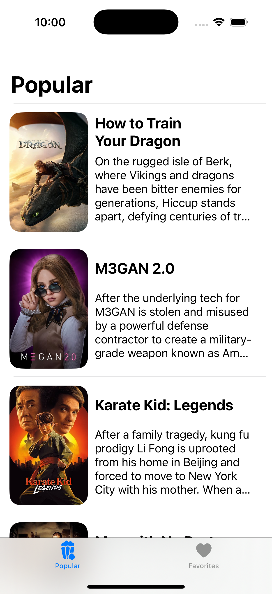
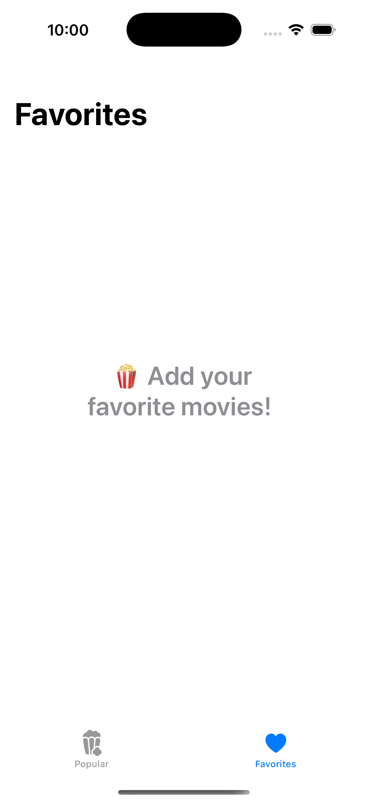

## Flix Hollywood 2025

### Overview

This app allow users to save their favorite movies and view them in a "favorites" list on a separate tab using User Defaults to save and retrieve movies from user app's local storage. 

#Features

- A list of hollywood movies released iin 2025 are displayed
- Users can toggle a *"Favorite"* button in the movie detail screen to save/delete a movie from their collection of favorite movies.
- Users can view a scrolling list of their favorite movies on a *"Favorites"* tab.

## App Screenshots

  
  
  
  
  

## License

    Copyright [2025] [Sneha Siri Nagabathula]

    Licensed under the Apache License, Version 2.0 (the "License");
    you may not use this file except in compliance with the License.
    You may obtain a copy of the License at

        http://www.apache.org/licenses/LICENSE-2.0

    Unless required by applicable law or agreed to in writing, software
    distributed under the License is distributed on an "AS IS" BASIS,
    WITHOUT WARRANTIES OR CONDITIONS OF ANY KIND, either express or implied.
    See the License for the specific language governing permissions and
    limitations under the License.
